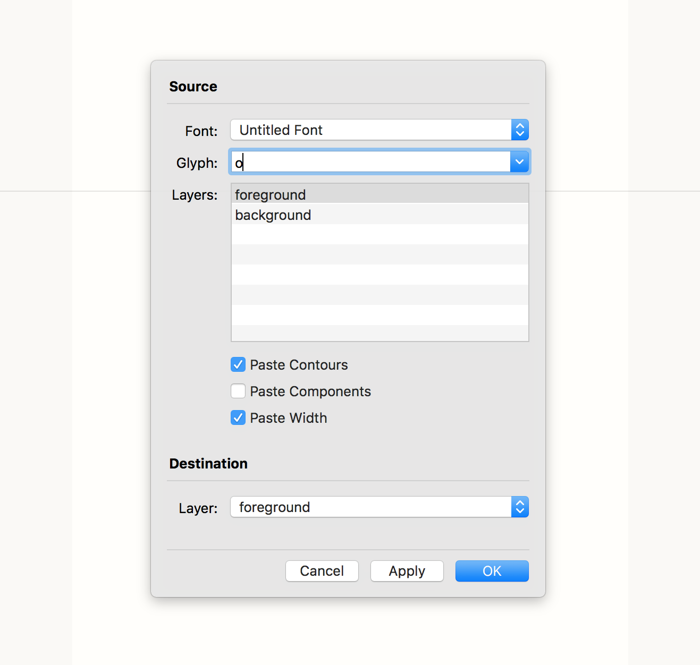

# Paste Glyph

*Note: this has only been lightly tested so far. Please report any bugs. Thanks!*

You know when you are working on your *e* and you want to compare the curves you are drawing to your *o* so you switch to the *o*, select all, copy, switch to the *e* and paste? Or when you are starting the *I* and you want the stem from the *H*? Or when you are drawing *=* and …? You get the idea. Those steps are annoying. This extension streamlines the *switch, select, copy, switch, paste* process. It allows you to paste a contours, components and the width from any layer of any glyph or any open font into the glyph you are currently working on. It also does more than one layer at a time if you want it to.

## Dependencies

This requires the [Booster extension](https://github.com/typesupply/booster) to be installed.

## Documentation

### Source

This will be the settings defining where to copy the data from.

- **Font:** Pick the font you want to copy from.
- **Glyph:** Enter the name of the glyph you want to copy from.
- **Layers:** Select the layer, or layers, that you want to copy from.
- **Paste Contours:** Check if you want to copy contours.
- **Paste Components:** Check if you want to copy components.
- **Paste Width:** Check if you want to copy the widths.

### Destination

This will be the settings defining where to paste the data to.

**Layer:** Select the layer you want to paste to. If you are copying more than one layer, this will be disabled and the layers to paste to will have the same names as the layers being copied from.

### Buttons

- **OK:** Paste with the current settings and close the window.
- **Apply:** Paste with the current settings and leave the window open so you can paste something else.
- **Cancel:** Close the window without pasting with the current settings. If you've used the *Apply* button, this will not undo those pastes. If you need to undo, use the standard *Undo* menu/key command.

*Note:* In *OK* and *Apply*, if you try to paste using the same settings twice in a row, the second time will be ignored. This prevents double pasting.

### Heuristics

Setting all of these buttons for a quick paste is fiddly, so the extension tries to apply some basic heuristics to set up the defaults for each paste. So, if you are wondering, "Why does it not always have the same settings when it first opens?" This is why.